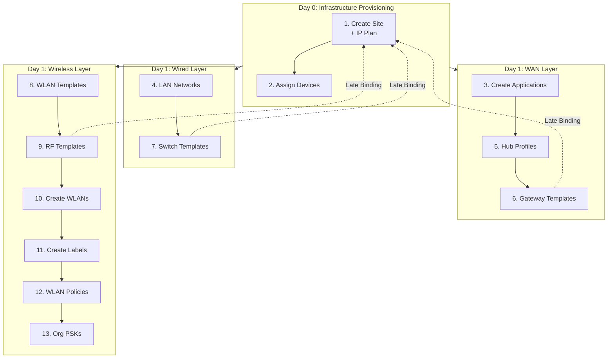

# eg-mist-orchestration-core

> **A Blueprint for AI-Native Network Automation.**
>
> *A reference architecture for bridging Network Design, Intent-Based Networking (IBN), and AI-Driven Operations.*

---

## Executive Summary

**`eg-mist-orchestration-core`** is a masterclass in Domain-Driven Design & Intent-Based Networking for the AI-Driven Enterprise.

This project demonstrates the evolution of network infrastructure from fragile, device-by-device configuration to robust, **AI-Native Software Engineering**. It eliminates "snowflake" configurations by implementing a strictly **idempotent**, **microservices-based** architecture that orchestrates the full lifecycle—from **Day 0 Identity** to **Day 2 Assurance**.

By treating the network as a distributed software system, this framework bridges the gap between **Network Design** (The "What") and **Software Architecture** (The "How").

## Standards Alignment

This architecture is designed in strict alignment with **Juniper's Device Life-Cycle Management (LCM)** standards. It utilizes official Mist primitives (**Site Variables**, **Activation Codes**, **SLEs**) ensuring forward compatibility and enterprise supportability.

---

## Architecture: The 3-Day Lifecycle

This core orchestrator is organized into three distinct domains, mirroring the modern Infrastructure-as-Code (IaC) lifecycle.

### Day 0: Genesis — Identity & Topology

Before policies or assurance can exist, we must establish the **Identity** of the Organization and the **Topology** of the network. We use "Digital Twin" principles to build the network virtually before hardware arrives.

The Genesis Layer defines six distinct, isolated domains implemented as separate service classes:

**1. Mist Connection Service**
- **Role:** Connectivity & Authentication
- **Action:** API validation layer that runs a "Reachability Probe" (`GET /org/self`) to verify the API Token is valid and the cloud is accessible

**2. IPAM Service**
- **Role:** Dynamic IP Planning & Geo-Zoning
- **Action:** Replaces manual spreadsheets with code. Acts as a dedicated Layer 3 engine that mathematically carves the `/8` Supernet into **8 Geographic Zones** (using `/11` blocks). Deterministically assigns subnets based on Region Code, eliminating human error and overlap

**3. NMS Service**
- **Role:** External Reference Data Aggregation
- **Action:** Integration point for all golden network reference data stored outside of Mist. Defines the hardware hierarchy (Routers → Switches → Access Points)

**4. Site Service**
- **Role:** Location Identity
- **Action:** Creates the "Digital Twin" of the physical real estate. Establishes the site's unique identity—physical address, time zone, and geo-coordinates—acting as the container where global NMS policies (Intent) meet specific hardware (Inventory)
- **Example:** Creating `NYC-Penn-Station` as a site object with Timezone `America/New_York` and Address `4 Pennsylvania Plaza`

**5. Applications Service**
- **Role:** Application Signatures
- **Action:** Defines global "Interesting Traffic" signatures (e.g., Zoom, O365, Salesforce, Workday) to ensure traffic classes are consistent across all sites

**6. Inventory Service**
- **Role:** Physical Device Activation
- **Action:** Utilizes **Mist Activation Codes** to bulk-claim hardware. Activates specific serial numbers to the Site Digital Twin, enabling Zero-Touch Provisioning (ZTP)

### Day 1: Intent & Policy

The Intent Layer implements Intent-Based Networking (IBN) by separating the **"What"** (Templates/Intent) from the **"Where"** (Sites/Instances). This "Late Binding" workflow ensures the network state always converges to the business requirement.

**Key Principles:**

- **Templates as Classes:** Define a "Gold Standard" (e.g., *Retail Switch Template*) once. All 1,000 sites inherit this class
- **Site Variables:** No hardcoded VLANs. Uses Mist Variables (e.g., `{{guest_vlan}}`). The Orchestrator injects unique values into the Site Shell during Day 0, while Day 1 Templates reference the abstract variable
- **Late Binding:** Configurations are not hard-coded to devices. Templates map to Site Groups, allowing entire region policy changes by updating a single UUID reference

### Day 2: Operations & Lifecycle

The deployment is not finished until the **User Experience** is validated. Day 2 splits into two automation domains:

**Assurance (Read)**
- Uses the API to "Unit Test" the infrastructure
- Queries **Service Level Expectations (SLEs)** to verify metrics like "Time to Connect," "Throughput," and "Roaming Efficacy"
- If SLE is <90%, the deployment is marked as **Failed**

**Lifecycle (Write)**
- Automates "Day N" mutations safely
- Implements **Canary Firmware Upgrades** (upgrade 1 AP → measure SLEs → upgrade site)
- Handles automated PSK rotation

---

## Technology Stack

| Technology | Purpose | Version |
|------------|---------|---------|
| **Python** | Runtime | 3.12 |
| **FastAPI** | Async web framework | 0.115.0 |
| **Pydantic** | Data validation & settings | 2.7.0 |
| **Redis** | State management | 7.1.0 (client) / 8.0 (server) |
| **Hypercorn** | ASGI server | 0.14.4 |
| **mistapi** | Juniper Mist SDK | 0.55.8 |
| **GitHub Actions** | CI/CD pipeline | - |

**Architecture:** Domain-Driven Design (DDD) Microservices

---

The orchestrator executes these steps in precise dependency order:

---

## Author

**Eric Gu**

- LinkedIn: [Connect with me](https://linkedin.com/in/ericcgu)

---

## Disclaimer

This project is an independent open-source tool and is not affiliated with, sponsored by, or endorsed by Juniper Networks, Inc. "Juniper" and "Mist" are trademarks of Juniper Networks, Inc.