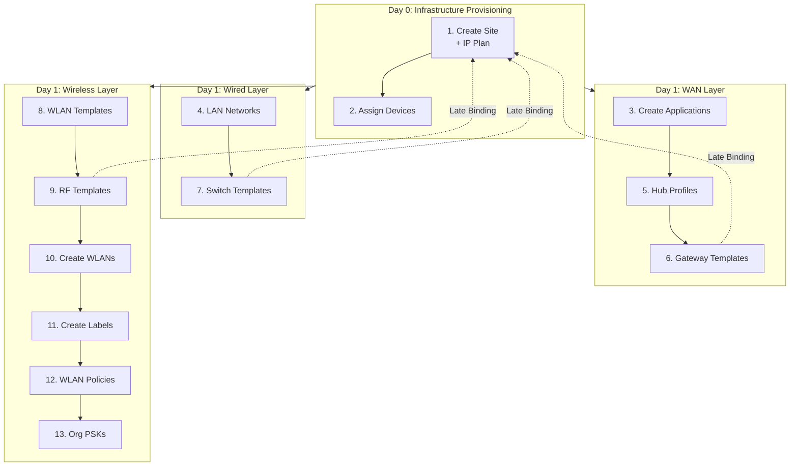

# eg-mist-orchestration-core

> **A Blueprint for AI-Native Network Automation.**
>
> *A reference architecture for bridging Network Design, Intent-Based Networking (IBN), and AI-Driven Operations.*

[](https://github.com/ericcgu/eg-mist-orchestration-core/actions)
[](https://www.python.org/downloads/release/python-312/)
[](https://fastapi.tiangolo.com)
[](https://redis.io)


---

## Executive Summary

**`eg-mist-orchestration-core`** is a masterclass in Domain-Driven Design & Intent-Based Networking for the AI-Driven Enterprise.

This project demonstrates the evolution of network infrastructure from fragile, device-by-device configuration to robust, **AI-Native Software Engineering**. It eliminates "snowflake" configurations by implementing a strictly **idempotent**, **service-based** architecture that orchestrates the full lifecycle—from **Day 0 Network Design & Topology** to **Day 2 Observability, Assurance & AIOps**.

By treating the network as a distributed software system, this framework bridges the gap between **Network Design** (The "What") and **Software Architecture** (The "How").

---

## Architecture: The 3-Day Lifecycle

This core orchestrator is organized into three distinct domains, mirroring the modern Infrastructure-as-Code (IaC) lifecycle.

### Day 0: Network Design & Topology

Before policies or assurance can exist, we establish the network's foundational design and topology. Using "Digital Twin" principles, the network is built virtually before hardware arrives.

Day 0 defines six distinct, isolated domains:

**1. Mist Connection Service**
- **Role:** Connectivity & Authentication
- **Action:** API validation layer that runs a "Reachability Probe" (`GET /org/self`) to verify the API Token is valid and the cloud is accessible

**2. IP Address Management (IPAM) Service**
- **Role:** Dynamic IP Planning & Geo-Zoning
- **Action:** Replaces manual spreadsheets with code. Acts as a dedicated Layer 3 engine that mathematically carves the `/8` Supernet into **8 Geographic Zones** (using `/11` blocks). Deterministically assigns subnets based on Region Code, eliminating human error and overlap

**3. Network Management System (NMS) Service**
- **Role:** External Reference Data Aggregation
- **Action:** Integration point for all golden network reference data stored outside of Mist. Defines the hardware hierarchy (Routers → Switches → Access Points)

**4. Site Service**
- **Role:** Location Identity
- **Action:** Creates the "Digital Twin" of the physical real estate. Establishes the site's unique identity—physical address, time zone, and geo-coordinates—acting as the container where global NMS policies (Intent) meet specific hardware (Inventory)
- **Example:** Creating `NYC-Penn-Station` as a site object with Timezone `America/New_York` and Address `4 Pennsylvania Plaza`

**5. Applications Service**
- **Role:** Application Signatures
- **Action:** Defines global "Interesting Traffic" signatures (e.g., Zoom, O365, Salesforce, Workday) to ensure traffic classes are consistent across all sites

**6. Inventory Service**
- **Role:** Physical Device Activation
- **Action:** Utilizes **Mist Activation Codes** to bulk-claim hardware. Activates specific serial numbers to the Site Digital Twin, enabling Zero-Touch Provisioning (ZTP)

### Day 1: Intent & Policy

Once the topology is established, Day 1 applies business rules to the infrastructure. We follow the packet path—**Router → Switch → AP**—to define Service Domains that govern behavior.

#### The Architectural Strategy: "From Edge to User"
We do not configure devices; we configure **Service Domains**. We define Intent in the same order a packet traverses the network to ensure dependency resolution (e.g., You cannot have Wi-Fi without a switch port, and you cannot have Internet without a router).

> **The "Abstract" Rule (Golden Rule):**
> Day 1 configurations must **never** contain static integers (e.g., "VLAN 10"). They must strictly use Jinja-style Variables (e.g., `{{user_vlan}}`) defined in Day 0. This ensures the "Class" (Template) remains reusable across 10,000 unique "Instances" (Sites).

#### Service Domain Mapping

| Folder | Medium | Discipline | Purpose |
|--------|--------|------------|---------|
| `0_routing_wan` | WAN | Routing | Edge transport |
| `1_wired_switching` | Wired | Switching | Physical connectivity |
| `2_wireless_mobility` | Wireless | Mobility | Roaming experience |

---

#### 1. WAN Domain Service - Routing
* **Physical Hardware:** Juniper SSR / SRX Gateways.
* **Role:** The "Routing & Security Class" (WAN Edge Templates & AppQoE).
* **The Strategy:**
    * **Traffic Steering:** Consumes the **Applications Service** (Day 0) to build "Traffic Lanes" (e.g., *"Zoom traffic takes the Express Lane (MPLS), YouTube takes the Local Lane (Broadband)"*).
    * **Breakout Policies:** Defines Local Internet Breakout rules globally, ensuring security compliance at the edge.
* **The Win:** "Zoom is slow" is no longer a routing problem; it is a policy object. You simply drag the `Zoom` app signature into the `High-Priority` bucket in the WAN Template.

#### 2. Wired Domain Service - Switching
* **Physical Hardware:** Juniper EX Series Switches.
* **Role:** The "Aggregation & Access Class" (Switch Templates).
* **The Strategy:**
    * **Colorless Ports:** We define abstract **Port Profiles** (e.g., `profile-ap`, `profile-camera`, `profile-corp-user`) rather than configuring "Port 4."
    * **Dynamic Binding:** When an AP is plugged into Port 4, LLDP detects it and automatically applies the `profile-ap`.
    * **Variable Mapping:** The profile does not say "VLAN 10." It says `vlan_id = {{mgmt_vlan}}`. The specific integer is injected by the Day 0 Site Context.
* **The Win:** Eliminates the need to manually configure ports. A switch port detects an AP and automatically applies the correct profile and VLANs without human intervention.

#### 3. Wireless Domain Service - Mobility
* **Physical Hardware:** Juniper Mist Access Points.
* **Role:** The "Mobility & RF Class" (RF Profiles & WLAN Templates).
* **The Strategy:**
    * **RF Abstraction:** We create strict physics profiles (e.g., `High-Density-Auditorium` vs. `Low-Density-Warehouse`) to standardize Radio Resource Management (RRM).
    * **SSID Abstraction:** The SSID name might be static ("Corp-Wifi"), but the backend authentication (Radius Servers) is a variable (`{{radius_ip}}`).
* **The Win:** Decouples the "Wi-Fi Experience" from physical site geometry. This allows you to rotate a RADIUS Secret Key across 5,000 sites instantly by updating a single JSON field in the global Template.

### Day 2: Operations & Lifecycle

The deployment is not finished until the **User Experience** is validated. Day 2 splits into two automation domains:

**Assurance (Read)**
- Uses the API to "Unit Test" the infrastructure
- Queries **Service Level Expectations (SLEs)** to verify metrics like "Time to Connect," "Throughput," and "Roaming Efficacy"
- If SLE is <90%, the deployment is marked as **Failed**


**Lifecycle (Write)**
- Automates "Day N" mutations safely
- Implements **Canary Firmware Upgrades** (upgrade 1 AP → measure SLEs → upgrade site)
- Handles automated PSK rotation

---

## App Directory Structure: Routers

```
/routers
├── admin.py               # Day 0: Reachability & Org Context
├── topology.py            # Day 0: Site Creation & IP Calc
├── inventory.py           # Day 0: ZTP & Supply Chain
│
└── day1/                  # Day 1: Intent & Policy Domains
    ├── 0_routing_wan/
    │   ├── edge_templates.py    # Router "Class" Definitions
    │   └── traffic_steering.py  # "Zoom -> MPLS" Logic
    │
    ├── 1_wired_switching/
    │   ├── switch_templates.py  # Switch "Class" Definitions
    │   └── port_profiles.py     # "Colorless Ports" Logic
    │
    └── 2_wireless_mobility/
        ├── wlan_intents.py      # SSID & Security Logic
        └── rf_optimization.py   # RRM & Physics Profiles
```

---

## Technology Stack

| Technology | Purpose | Version |
|------------|---------|---------|
| **Python** | Runtime | 3.12 |
| **FastAPI** | Async web framework | 0.115.0 |
| **Pydantic** | Data validation & settings | 2.7.0 |
| **Redis** | State management | 7.1.0 (client) / 8.0 (server) |
| **Hypercorn** | ASGI server | 0.14.4 |
| **httpx** | Async HTTP client | 0.28.1 |
| **GitHub Actions** | CI/CD pipeline | - |

**Architecture:** Domain-Driven Design (DDD) Microservices

---

The orchestrator executes these steps in precise dependency order:



---

## Author

**Eric Gu**

- LinkedIn: [Connect with me](https://linkedin.com/in/ericcgu)

---

## Disclaimer

This project is an independent open-source tool and is not affiliated with, sponsored by, or endorsed by Juniper Networks, Inc. "Juniper" and "Mist" are trademarks of Juniper Networks, Inc.