# 🚀 juniper-mist-orchestration-core

> **The Blueprint for AI-Native Network Automation.**
>
> *A Distinguished Engineer's reference architecture for bridging Network Design, Intent-Based Networking (IBN), and AI-Driven Operations.*

---

## 💼 Executive Summary

**`juniper-mist-orchestration-core`** is a masterclass in Domain-Driven Design & Intent-Based Networking for the AI-Driven Enterprise.

This project demonstrates the evolution of network infrastructure from fragile, device-by-device configuration to robust, **AI-Native Software Engineering**. It eliminates "snowflake" configurations by implementing a strictly **idempotent**, **microservices-based** architecture that orchestrates the full lifecycle—from **Day 0 Identity** to **Day 2 Assurance**.

By treating the network as a distributed software system, this framework bridges the gap between **Network Design** (The "What") and **Software Architecture** (The "How").

### ✅ Standards Alignment

This architecture is designed in strict alignment with **Juniper's Device Life-Cycle Management (LCM)** standards. It utilizes official Mist primitives (**Site Variables**, **Activation Codes**, **SLEs**) ensuring forward compatibility and enterprise supportability.

---

## 🏗 The Architecture: "The 3-Day Lifecycle"

This core orchestrator is organized into three distinct domains, mirroring the modern Infrastructure-as-Code (IaC) lifecycle.

### 🌅 Module 1: Day 0 — Genesis: Identity & Topology

**"The Genesis Layer"**

Before policies or assurance can exist, we must establish the **Identity** of the Organization and the **Topology** of the network. We use "Digital Twin" principles to build the network virtually before hardware arrives.

* **Control Plane Identity:** A "Reachability Probe" (`GET /org/self`) validates the API Token, Cloud Context, and `Superuser` write privileges before execution.
* **Algorithmic Topology:** Manual IP spreadsheets are replaced by a `NetworkCalculator` service that mathematically carves a `/8` Supernet into 8 geographic Zones (using `/11` blocks).
* **Supply Chain Identity (ZTP):** We utilize Mist **Activation Codes** to bulk-claim hardware. The "Identity" of the device is bound to the "Topology" of the site *before* the device is physically installed, enabling true Zero-Touch Provisioning.

### 📜 Module 2: Day 1 — Intent & Policy

**"The Intent Layer"**

#### Intent-Based Networking (IBN)

The architecture separates the **"What"** (Templates/Intent) from the **"Where"** (Sites/Instances). The "Late Binding" workflow is a pure implementation of IBN: you define the Intent (Policy) first, and then map that intent to the physical infrastructure, ensuring the network state always converges to the business requirement.

* **Templates as Classes:** We define a "Gold Standard" (e.g., *Retail Switch Template*) once. All 1,000 sites inherit this class.
* **Site Variables (The Secret Sauce):** We do not hardcode VLANs. We use Mist Variables (e.g., `{{guest_vlan}}`). The Orchestrator injects the unique values into the Site Shell during Day 0, while the Day 1 Template references the abstract variable.
* **Late Binding:** Configurations are not hard-coded to devices. We map **Templates** to **Site Groups**. This allows us to re-architect an entire region's policy by changing a single UUID reference in the API.

### 🔄 Module 3: Day 2 — Operations & Lifecycle

**"The Closed Loop"**

The deployment is not finished until the **User Experience** is validated. We split Day 2 into two automation domains: **Assurance (Read)** and **Lifecycle (Write)**.

* **Assurance (The Observer):** We use the API to "Unit Test" the infrastructure. We query **Service Level Expectations (SLEs)** to verify metrics like "Time to Connect," "Throughput," and "Roaming Efficacy." If the SLE is <90%, the deployment is marked as **Failed**.
* **Lifecycle (The Updater):** We automate "Day N" mutations safely. This includes **Canary Firmware Upgrades** (upgrade 1 AP → measure SLEs → upgrade site) and automated PSK rotation.

---

## 🛠 Technology Stack

| Technology | Purpose | Version |
|------------|---------|---------|
| **Python** | Runtime | 3.12 |
| **FastAPI** | Async web framework | 0.115.0 |
| **Pydantic** | Data validation & settings | 2.7.0 |
| **Redis** | State management | 7.1.0 (client) / 8.0 (server) |
| **Hypercorn** | ASGI server | 0.14.4 |
| **mistapi** | Juniper Mist SDK | 0.55.8 |
| **Railway** | Cloud deployment | - |
| **GitHub Actions** | CI/CD pipeline | - |

**Architecture:** Domain-Driven Design (DDD) Microservices

---

## 🔄 The Workflow API

| Step | Endpoint | Domain | Action |
| :--- | :--- | :--- | :--- |
| **0** | `POST /org/self` | **Identity** | **Reachability:** Verifies API Access & Write Perms. |
| **1** | `POST /topology/site` | **Topology** | **Design:** Creates Site Shell & Injects **Site Variables**. |
| **2** | `POST /inventory/ztp` | **Logistics** | **ZTP:** Ingests Activation Codes & Binds Hardware. |
| **3** | `POST /wired/templates` | **Intent** | **Policy:** Defines Global Switch/Gateway Templates. |
| **4** | `GET /assurance/health` | **Assurance** | **Validation:** Unit Tests the UX via Mist SLEs. |
| **5** | `POST /lifecycle/upgrade` | **Updates** | **Day N:** Triggers Safe/Canary Firmware Updates. |

---

## 🔄 The 13-Step Workflow

The orchestrator executes these steps in precise dependency order:

```mermaid
flowchart TB
    subgraph DAY0["☀️ Day 0: Infrastructure Provisioning"]
        S1["1️⃣ Create Site<br/>+ IP Plan"]
        S2["2️⃣ Assign Devices"]
        S1 --> S2
    end

    subgraph DAY1_WAN["🌐 Day 1: WAN Layer"]
        S3["3️⃣ Create Applications"]
        S5["5️⃣ Hub Profiles"]
        S6["6️⃣ Gateway Templates"]
        S3 --> S5 --> S6
    end

    subgraph DAY1_WIRED["🔌 Day 1: Wired Layer"]
        S4["4️⃣ LAN Networks"]
        S7["7️⃣ Switch Templates"]
        S4 --> S7
    end

    subgraph DAY1_WIRELESS["📡 Day 1: Wireless Layer"]
        S8["8️⃣ WLAN Templates"]
        S9["9️⃣ RF Templates"]
        S10["🔟 Create WLANs"]
        S11["1️⃣1️⃣ Create Labels"]
        S12["1️⃣2️⃣ WLAN Policies"]
        S13["1️⃣3️⃣ Org PSKs"]
        S8 --> S9 --> S10 --> S11 --> S12 --> S13
    end

    DAY0 --> DAY1_WAN
    DAY0 --> DAY1_WIRED
    DAY0 --> DAY1_WIRELESS

    S6 -.-> |Late Binding| S1
    S7 -.-> |Late Binding| S1
    S9 -.-> |Late Binding| S1
```

---

## 👤 Author

**Eric Gu**

- GitHub: [@ericcgu](https://github.com/ericcgu)
- LinkedIn: [Connect with me](https://linkedin.com/in/ericcgu)